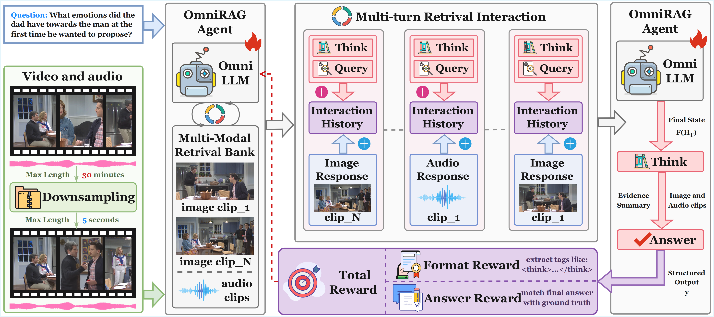

# OmniRAG-Agent: Agentic Omnimodal Reasoning for Low-Resource Long Audio-Video Question Answering

OmniRAG-Agent: Agentic Omnimodal Reasoning for Low-Resource Long Audio-Video Question Answering \[[paper](https://arxiv.org/abs/2602.03707)\]

## Overview



Long-horizon omnimodal question answering answers questions by reasoning over text, images, audio, and video. Despite recent progress on OmniLLMs, low-resource long audio-video QA still suffers from costly dense encoding, weak fine-grained retrieval, limited proactive planning, and no clear end-to-end optimization.To address these issues, we propose OmniRAG-Agent, an agentic omnimodal QA method for budgeted long audio-video reasoning. It builds an image–audio retrieval-augmented generation module that lets an OmniLLM fetch short, relevant frames and audio snippets from external banks. Moreover, it uses an agent loop that plans, calls tools across turns, and merges retrieved evidence to answer complex queries. Furthermore, we apply group relative policy optimization to jointly improve tool use and answer quality over time. Experiments on OmniVideoBench, WorldSense, and Daily-Omni show that OmniRAG-Agent consistently outperforms prior methods under low-resource settings and achieves strong results, with ablations validating each component.

---

## OmniRAG-Agent Implementation

### Install Environment

```bash
# Create conda environment
conda create -n omnirag python==3.10
conda activate omnirag

# Install PyTorch (adjust CUDA version as needed)
pip install torch==2.6.0 --index-url https://download.pytorch.org/whl/cu124

# Install flash-attn for efficient attention
pip install flash-attn --no-build-isolation

# Install the project in editable mode
pip install -e .

# Install GPU acceleration extras
pip install -e ".[gpu]"

# Install vLLM backend (required for rollout)
pip install -e ".[vllm]"
```

---

### Dataset Preparation

We train and evaluate on the **OmniVideoBench** dataset. Download the dataset and place it under `data/videoomnibench/`:

```
data/
└── videoomnibench/
    ├── train.parquet
    └── test.parquet
    └── test_agent.jsonl
```

Each sample in the parquet file contains the following fields:

```json
{
  "video_id": "hHwdqJxc",
  "prompt": [{"role": "user", "content": "..."}],
  "videos": ["path/to/video.mp4"],
  "extra_info": {
    "question": "What is happening in the video?"
  },
  "reward_model_ground_truth": {
    "correct_option": "A",
    "multi_choice": ["option A", "option B", "option C", "option D"]
  }
}
```

---

### Quick Start: OmniRAG-Agent on OmniVideoBench

#### 1. Build image retrieval index

Run `embeddings.py` to extract keyframes from each video, embed them with CLIP, and write the image FAISS index. Edit the paths at the bottom of the script before running:

```python
# retrival_api/embeddings.py  (lines 478-488)
TEST_JSON = "data/videoomnibench/test.json"       # JSON file listing video IDs
VIDEOS_DIR = "data/videoomnibench/videos"          # raw video files
RAG_DB_ROOT = "retrival_api/rag_db"               # output root
```

Then run:

```bash
cd retrival_api
nohup python embeddings.py > result_build_image_index.log 2>&1 &
```

This creates the following structure under `retrival_api/rag_db/videos/<video_id>/`:

```
retrival_api/rag_db/videos/
└── <video_id>/
    ├── segments/
    │   └── frames/    # Extracted keyframe images (.jpg)
    │   └── audio/     # Extracted audio clips (.wav)
    ├── index.faiss    # CLIP image FAISS index
    └── meta.jsonl     # Frame segment metadata
```

#### 2. Build audio ASR index

Transcribe audio clips with Whisper and build audio FAISS indices:

```bash
nohup python retrival_api/build_audio_index.py \
    --input_dir data/videoomnibench/videos \
    --out_dir retrival_api/rag_db/videos \
    --workers 4 \
    --model-size small \
    --device cuda > result_build_audio_index.log 2>&1 &
```

This adds to each video directory:

```
└── <video_id>/
    ├── audio_index.faiss    # ASR-based audio FAISS index
    └── audio_meta.jsonl     # Audio segment metadata with transcripts
```

#### 3. Start RAG retrieval server on port 8001

```bash
nohup python -m uvicorn retrival_api.retriever:app \
    --host 0.0.0.0 --port 8001 > result_api.log 2>&1 &
```

The server exposes two endpoints:
- `POST /query` — retrieve top-k video frames by text query
- `POST /query_audio` — retrieve top-k audio segments by text query

#### 4. Run GRPO training with Qwen2.5-Omni-3B (requires 4 × 40GB GPUs)

```bash
nohup bash -u examples/grpo_trainer/run_omni_searchqa.sh \
    > result_run_omni_searchqa_grpo.log 2>&1 &
```

Key training hyperparameters (see `examples/grpo_trainer/run_omni_searchqa.sh`):

| Parameter | Value | Description |
|-----------|-------|-------------|
| `algorithm.adv_estimator` | `grpo` | GRPO advantage estimator |
| `env.env_name` | `omni_searchqa` | OmniSearchQA agent environment |
| `env.max_steps` | `20` | Max agent turns per episode |
| `env.rollout.n` | `4` | Group size for GRPO |
| `data.max_prompt_length` | `28672` | Max context length |
| `data.max_response_length` | `4096` | Max generation length |
| `actor_rollout_ref.model.path` | `Qwen2.5-Omni-3B` | Base model |
| `actor_rollout_ref.actor.optim.lr` | `5e-7` | Learning rate |
| `actor_rollout_ref.actor.kl_loss_coef` | `0.001` | KL penalty coefficient |
| `actor_rollout_ref.rollout.max_model_len` | `32768` | vLLM max sequence length |
| `trainer.n_gpus_per_node` | `4` | GPUs per node |
| `trainer.total_epochs` | `1` | Training epochs |

Checkpoints are saved to `checkpoints/verl_grpo_omni_searchqa/` every 8 steps.

#### 5. Shut down the RAG server

```bash
fuser -k 8001/tcp
```

---

### Evaluation

After training, evaluate the fine-tuned model on the test set:

```bash
python omni_batch_eval.py \
    --jsonl data/videoomnibench/test.jsonl \
    --out-traj results/output_trajectory.jsonl \
    --out-summary results/output_summary.json \
    --model-path /path/to/finetuned_model \
    --rag-url http://127.0.0.1:8001 \
    --rag-db-root retrival_api/rag_db \
    --videos-dir data/videoomnibench/videos \
    --include-video \
    --top-k 5 \
    --max-turns 20
```

**Evaluation arguments:**

| Argument | Default | Description |
|----------|---------|-------------|
| `--jsonl` | required | Test set path (JSONL or JSON) |
| `--out-traj` | required | Output trajectory file (JSONL) |
| `--out-summary` | required | Output accuracy summary (JSON) |
| `--model-path` | required | Path to Qwen2.5-Omni model |
| `--rag-url` | `http://127.0.0.1:8001` | RAG service endpoint |
| `--rag-db-root` | `retrival_api/rag_db` | RAG database root directory |
| `--videos-dir` | `datasets/OmniVideoBench/videos_downsampled` | Video files directory |
| `--video-suffix` | `_k1_g5.mp4` | Video filename suffix |
| `--top-k` | `5` | Top-k results returned per RAG query |
| `--max-turns` | `20` | Max agent turns per sample |
| `--attach-segments` | `3` | Number of media segments to attach per retrieval |
| `--include-video` | `False` | Include raw video in the first turn |
| `--resume` | `False` | Resume from existing output trajectory |

The evaluation outputs a summary JSON with overall accuracy:

```json
{
  "total": 1000,
  "correct": 720,
  "accuracy": 0.72,
  "missing_gt": 0,
  "args": { "..." : "..." }
}
```

---

## Project Structure

```
rl-omni/
├── omni_batch_eval.py              # Agent evaluation script
├── examples/
│   └── grpo_trainer/
│       └── run_omni_searchqa.sh   # GRPO training launch script
├── verl/
│   ├── trainer/
│   │   ├── main_ppo.py            # Training entry point (Hydra + Ray)
│   │   └── config/
│   │       └── ppo_trainer.yaml   # Master training configuration
│   ├── workers/                   # Distributed Actor/Critic/Rollout workers
│   └── utils/                     # Tokenizer, FSDP, vLLM utilities
├── agent_system/
│   └── environments/
│       └── env_package/
│           └── omni_searchqa/     # OmniSearchQA RL environment
├── retrival_api/
│   ├── retriever.py               # FastAPI RAG service (port 8001)
│   ├── embeddings.py              # CLIP text/image embeddings
│   ├── video_ingest.py            # Video frame & audio segment extraction
│   └── build_audio_index.py       # Whisper ASR + FAISS audio index builder
└── gigpo/                         # GiGPO algorithm implementation
```

## BibTex
If you find this work is helpful for your research, please cite:
```
@article{zhu2026omnirag,
  title={OmniRAG-Agent: Agentic Omnimodal Reasoning for Low-Resource Long Audio-Video Question Answering},
  author={Zhu, Yifan and Mu, Xinyu and Feng, Tao and Ou, Zhonghong and Gong, Yuning and Luo, Haoran},
  journal={arXiv preprint arXiv:2602.03707},
  year={2026}
}
```
